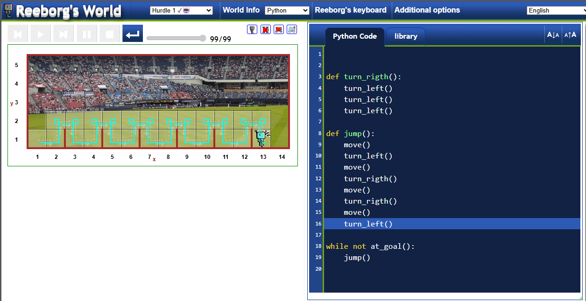
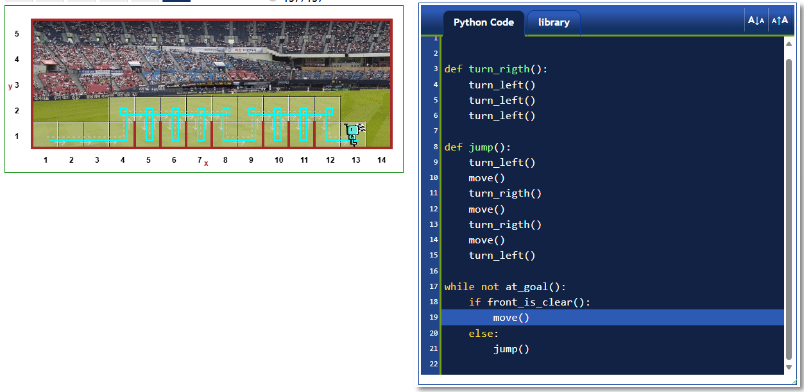

# 🐍 Día 6 - Funciones, bloques de codigo y ciclo while

## Funciones
Si lo pensamos ya hemos usado funciones en python, el cual tiene integrado muchas funciones que se han usado en el curso, print, len, sum. la forma tipica de llamar a uan función es su nombre seguido de parentesis, con sus argumentnos si es que lo tiene

print("cadena de texto")
len("hola mundo")

sin embargo podemos crear nuestras propias funciones, recordemos que las funciones son formas de simplificar codigo para evitar que este sea repetido dentro de un script

### Mi solución al reto reeborg's world

si quieres probar el reto: https://reeborg.ca/reeborg.html?lang=en&mode=python&menu=worlds%2Fmenus%2Freeborg_intro_en.json&name=Hurdle%201&url=worlds%2Ftutorial_en%2Fhurdle1.json

## Identación
Ya lo hemos visto anteriormente, identar se define como una tecnica donde damos espacios en la parte inicial de una linea, tal que se ve mejor visualmente y define como se realizara la ejecución del codigo.

La analogía para esto es como se distribuyen las carpetas, puedes ver como estan una dentro de otra de forma identada.

### Espacios vs Tabs
la forma de identar puede variar de acuerdo agregar un poco más acerca de esto

## Ciclo While
como se menciono anteriormente este ciclo se usa con una condición, es decir este se ejefcutara siempre y cuando se cumpla una o varias condiciones.

### Evita el ciclo infinito
Si bien los ciclos while pueden ser muy utiles debemos evitar caer en un ciclo infinito, es decir dentro del ciclo debemos tener una variable que se encargue de validar la condición para saber si el ciclo debe continuar su repetición.

### For vs While
Crea una tabla para comparar cuando usarlos y cuando conviene

## Recursos de clases
- conoce más de las funciones integradas en python: https://docs.python.org/3/library/functions.html
- Practica un poco tu logica y el manejo de funciones: https://reeborg.ca/reeborg.html?lang=en&mode=python&menu=worlds%2Fmenus%2Freeborg_intro_en.json&name=Alone&url=worlds%2Ftutorial_en%2Falone.json
- Conoce más acerca de tener un buena practica: https://peps.python.org/pep-0008/